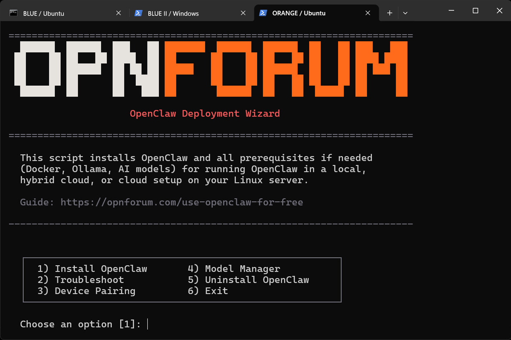

https://opnforum.com/openclaw-linux-installation-wizard/

The opnForum.com OpenClaw Linux installation wizard deploys OpenClaw onto your Linux server in minutes with three available configurations: Local AI, Hybrid Cloud, and Cloud. The wizard installs all prerequisites if needed (Ollama and Docker), downloads local LLM models, and generates the required SSL certificate. It currently works on Debian/Ubuntu, Fedora/RHEL, and Arch-based distros.

The Local AI configuration lets you run OpenClaw completely free of charge depending on your hardware. The Hybrid Cloud setup lets you save tokens on simple prompts while larger, more complex tasks are handled by your Cloud AI provider of choice.

The installer lets you choose, download, and run your desired local LLMs from a menu. For Cloud AI, the wizard works with all major providers and gives you a menu to select your preferred models. The installer  also automatically detects your network and hardware for a streamlined setup, and will warn you if your machine isn’t equipped to power local AI.

Other features include a troubleshooter for when something goes wrong, a model manager to switch out models fast without manual editing, a live device pairing menu, and a full uninstaller that can also remove Docker and Ollama if desired.
Full Details:
Install Process

    Three modes: cloud only, local AI, or hybrid (local + cloud fallback)
    Auto-detects your server IP, RAM, and GPU VRAM
    Installs Docker, Ollama, and your AI model if needed
    Supports Debian/Ubuntu, Fedora/RHEL, and Arch-based distros
    Generates SSL certs, nginx proxy, and all config files automatically
    Validates your API key before starting
    Handles the OpenClaw first-boot config overwrite bug for you

Cloud Providers

    OpenAI (GPT-4o, GPT-4.1)
    Anthropic (Claude Haiku, Sonnet, Opus)
    Groq (Llama 3.3 70B, free tier available)
    OpenRouter (200+ models, one API key)
    Google Gemini (2.0 Flash, 2.0 Pro)
    Custom model name option for every provider

Local Models

    Qwen 2.5 (3B, 7B, 14B)
    Gemma 4 (E2B, E4B, 26B) with multimodal image and text support
    GPT-OSS 20B
    Custom Ollama model support
    Auto-downloads your chosen model during setup

Model Manager

    Switch local models, cloud models, or both without reinstalling
    Swap cloud providers (OpenAI to Groq, etc.) with automatic API key and config handling
    Downloads new local models automatically
    Preserves your gateway token, IP, and port

Device Pairing

    View pending device requests
    Approve devices by ID
    Refresh loop for easy polling

Troubleshooter

    Checks for 6 known error patterns from real-world debugging
    Shows container status, recent logs, Ollama health, and config validation

Uninstaller

    Removes OpenClaw, Ollama, Docker, and downloaded models separately
    Everything defaults to no, nothing gets deleted by accident
    Uses the correct package manager for your distro

Installation Locations

    OpenClaw project files: ~/openclaw/
    OpenClaw data and config: ~/.openclaw/
    SSL certificates: ~/openclaw/certs/
    Downloaded AI models: ~/.ollama/

To Run:

chmod +x openclaw-wizard.sh && ./openclaw-wizard.sh

If you want to understand what’s happening under the hood, or prefer to set things up manually, you can find a full walk through by Lynx at the link below…

https://opnforum.com/use-openclaw-for-free/

https://www.virustotal.com/gui/file/c8d5aad3e7084db3a3462b300ca46769032245523515375054cd54e7ffc7ce59
